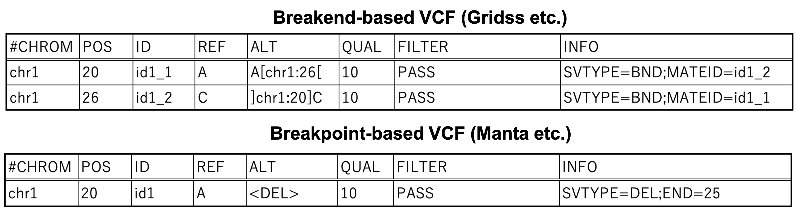
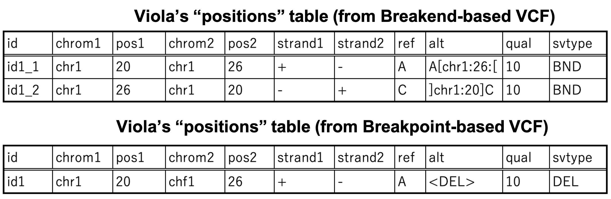
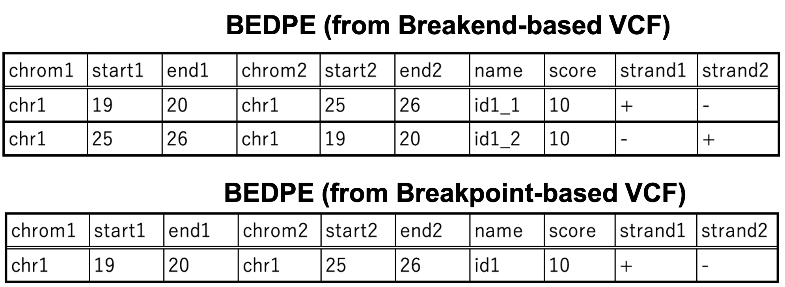
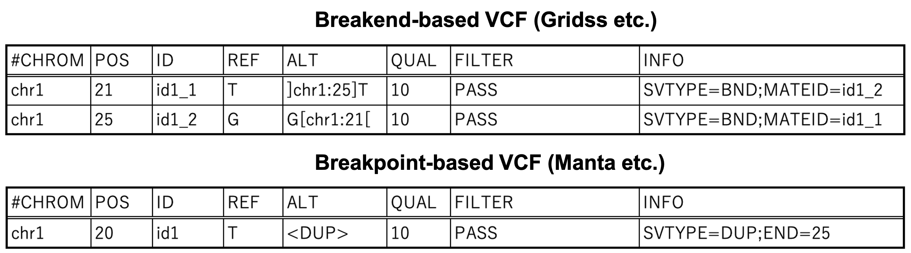
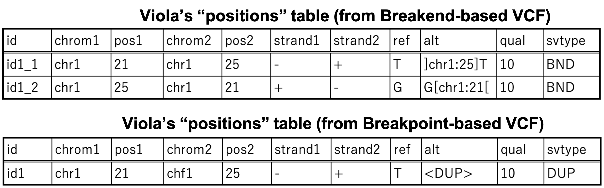
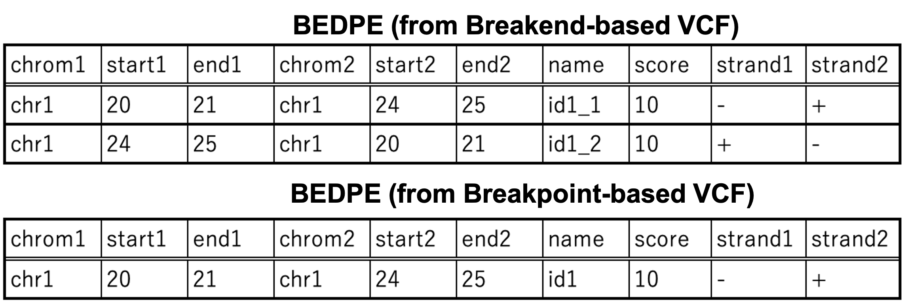
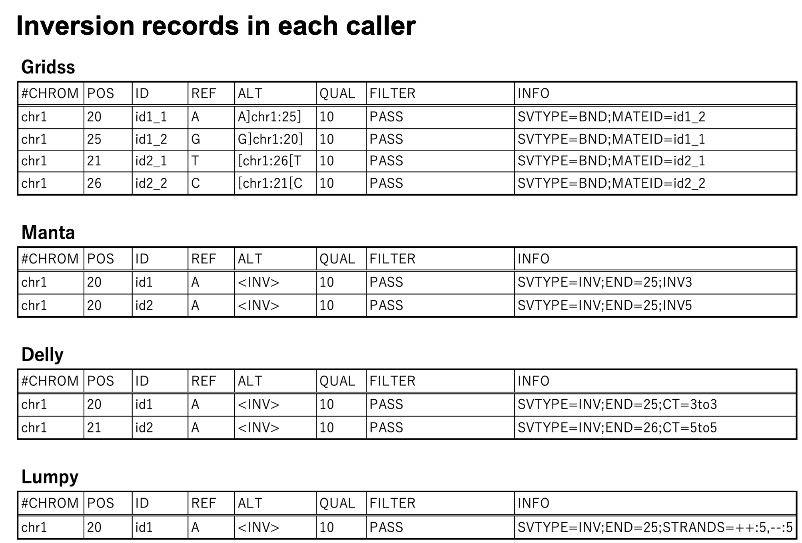
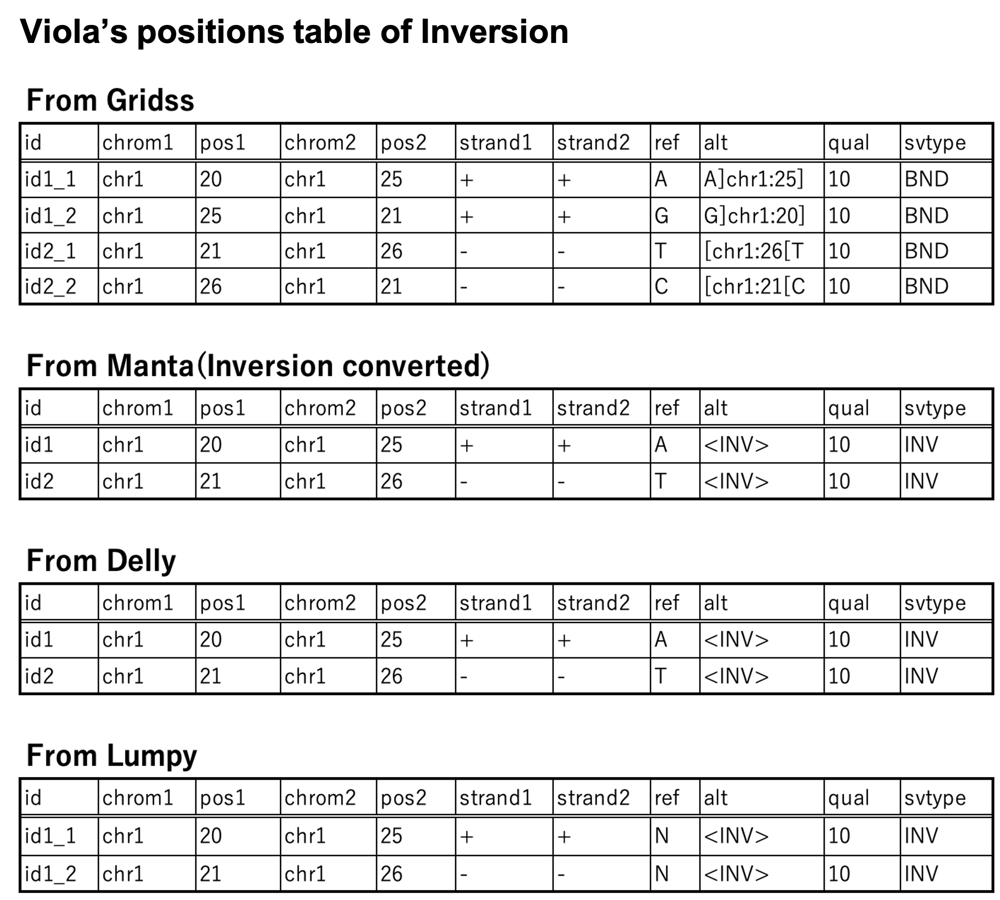
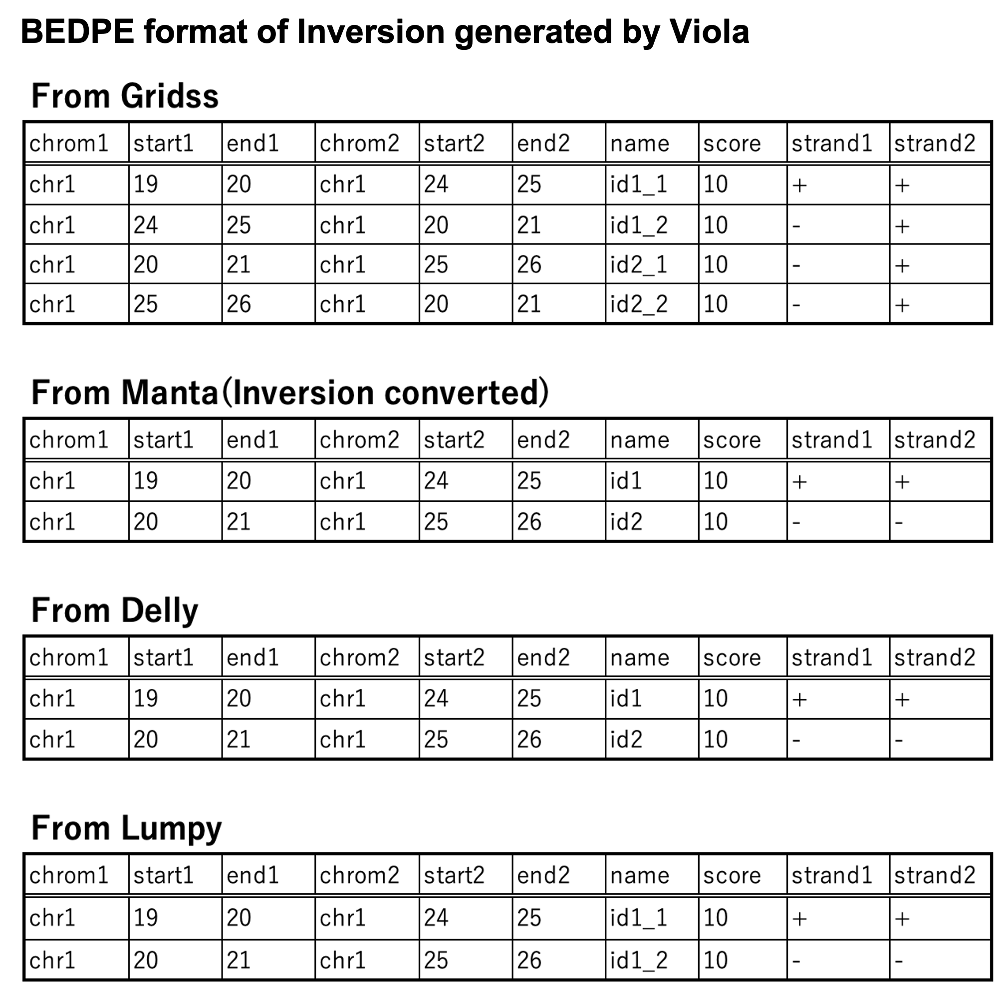

.. _sv_position_specification:

==========================================
Specification of SV positions in Viola
==========================================

The specification of SV positions varies from SV caller to SV caller.
It can be misleading to know exactly which genomic coordinates the SV of interest is located in.

Viola normalises the output of different SV callers and provides a well-defined specification.

Here we will explain how Viola normalises the position of SVs, with graphical examples for better understanding.

----------------------------------------
Deletion
----------------------------------------

First, we'll start from "Deletion".

The top of the figure is the reference sequence.

When "Deletion" occurs, two breakends appear. In this figure, one breakend is position 20 and another is 26 (middle). 

These two breakends consists one breakpoint (bottom).

This "Deletion" event is recorded in VCF format, as shown above.
Normally, there are two ways of writing down a "Deletion" event; breakend-based recording and breakpoint-based recording.

Gridss, for example, employs breakend-based recording system. Since two breakends arise from one "Deletion" event, the VCF has two lines of SV record (top).
Manta, Delly, and Lumpy uses breakpoint-based recording for Deletion, so only one line indicates the event.

Viola object like :ref:`viola.Vcf<vcf>` and :ref:`viola.Bedpe<bedpe>` stores SV position in the table named ``positions``. 
The figure shown just above is the content of ``positions`` table.

The positions in this table is breakend-based, such that the ``pos1`` and ``pos2`` columns indicate the genomic coordinates of two breakends.
Strands for each breakend are written in ``strand1`` and ``strand2`` fields, where '+' means 3' half is missing, and vice versa.

Whether the SV records will be two lines or one line depends on the SV caller by which the input VCF is made.

If you want to convert breakend-based notation into breakpoint-based one, consider using :doc:`viola.Vcf.breakend2breakpoint()<../reference/api/viola.Vcf.breakend2breakpoint>`.

Viola supports BEDPE output (See :doc:`viola.Vcf.to_bedpe()<../reference/api/viola.Vcf.to_bedpe>`). The BEDPE specification is written in `bedtools documentation`_.

.. _bedtools documentation: https://bedtools.readthedocs.io/en/latest/content/general-usage.html

For further understandings, we will show how Viola exports BEDPE exactly.

- ``end1`` and ``end2`` columns of BEDPE are exactly same as ``pos1`` and ``pos2`` columns of Viola's ``positions`` table.
- ``start1`` and ``start2`` columns are 0-origin position, so the following formula holds: ``start1`` + 1 = ``end1``, ``start2`` + 1 = ``end2``

----------------------------
Duplication
----------------------------

Next, let's move on "Duplication", especially "Tandem Duplication" where a certain segment is duplicated exactly next to the other.

In this case, the breakend of position 25 and 21 are connecting to produce "Tandem Duplication" breakpoint (middle and bottom).

Corresponding VCF, ``positions`` table, and BEDPE format are shown above.

-----------------------------
Inversion
-----------------------------

Regarding to the VCF, "Inversion" is the most confusing thing, since all SV callers output with different conventions!

This is the "Inversion" events we'll explain in depth below. There are two breakpoints in this figure.

This is the VCF records for each SV caller.
Gridss employs breakend-based notation here, too. 
Manta originally outputs breakend-based records of “Inversion", but these can be converted to breakpoint-based VCFs by using scripts coded by Manta's developers.
Manta outputs the start position as 20 and the end position as 25, regardless of the "Inversion" strand; Lumpy is similar, but the output is on one line. In contrast, Delly adds 1 to the start and end positions for negative strands.

On the viola, in "Inversion", We were keen to express the SV position on a break-end basis.
With regard to Lumpy, we have divided "Inversion" into two lines to fit our principles.

For BEDPE output, the same method as for "Deletion" is also used here.

--------------------
Translocation
--------------------

Coming Soon.